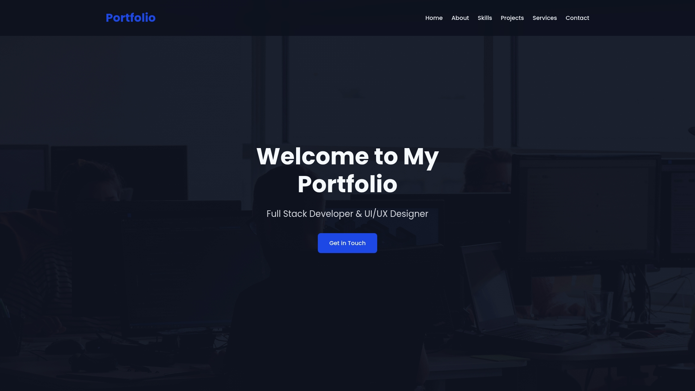

# Portfolio Website

This is a simple portfolio website built with Flask framework with administrator dashboard for content management.



## Built With
- **Backend**: Flask (Python web framework)
- **Database**: SQLAlchemy ORM with SQLite (local development) and PostgreSQL support (production)
- **Frontend**: HTML, CSS, JavaScript
- **Authentication**: Flask-Login for secure admin access
- **Forms**: Flask-WTF for form validation and processing
- **CSS Features**: Custom animations, responsive grid layout, and mobile-first design

## Project Structure
- **Models**: User, Project, Experience, and Service classes
- **Forms**: Contact and authentication forms with validation
- **Routes**: Public-facing portfolio and admin-only dashboard
- **Templates**: Jinja2 templates with a modular approach (base layout + content sections)

## Getting Started
1. Clone the repository
2. Install dependencies: `pip install -r requirements.txt`
3. Run the application: `gunicorn --bind 0.0.0.0:5000 main:app`
4. Access the website at `http://0.0.0.0:5000`
5. Admin login at `/admin/login` (default credentials: admin/admin123)

## Deployment
The application is configured to run with Gunicorn for production deployment on Replit.


# Environment Variables

## Settings

| Variable | Description | Default Value | Required |
|----------|-------------|---------------|----------|
| `SESSION_SECRET` | Secret key used for signing session cookies | `"dev-secret-key"` | No |
| `DATABASE_URL` | Database connection string | `"sqlite:///portfolio.db"` | No |

## Email Configuration

Flask-Mail with Gmail SMTP for sending emails. The following variables are needed for proper email functionality:

| Variable | Description | Default Value | Required |
|----------|-------------|---------------|----------|
| `MAIL_USERNAME` | Gmail account username | None | Yes (for email functionality) |
| `MAIL_PASSWORD` | Gmail account password or app password | None | Yes (for email functionality) |
| `ADMIN_EMAIL` | Email address to receive contact form submissions | None | Yes (for email functionality) |

## Database Configuration

The application automatically uses SQLite by default but can be configured to use other databases:

```python
app.config["SQLALCHEMY_DATABASE_URI"] = os.environ.get("DATABASE_URL", "sqlite:///portfolio.db")
```

## Environment Variables Usage Example

```python
# Email sending example from the contact route
msg = Message('New Contact Form Submission',
             sender=app.config['MAIL_DEFAULT_SENDER'],  # Uses MAIL_USERNAME
             recipients=[app.config['ADMIN_EMAIL']])    # Uses ADMIN_EMAIL
```

## Security Notes

- Never commit sensitive environment variables to version control
- For Gmail SMTP, use an app password instead of your primary account password
- In production, use a strong, random `SESSION_SECRET`

## License
This project is licensed under the MIT [LICENSE](LICENSE).
